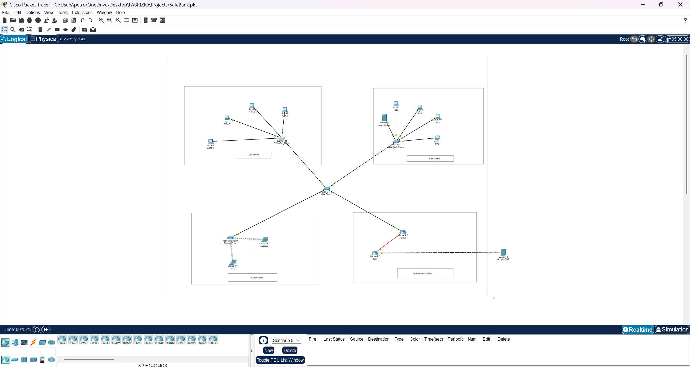

# 🏦 SecureBank - Regional Branch Network Architecture & Zero-Trust Hardening

---

## ⚠️ Important Disclaimer & Academic Integrity
* **Personal & Educational Project:** This repository showcases a personal, educational hands-on project. It does **not** represent a real deployed corporate banking infrastructure, and "SecureBank" is a fictional entity used solely for scenario-modeling purposes.
* **Academic Integrity Notice:** You are welcome to explore, study, and learn from this configuration. However, **plagiarism is strictly prohibited**. Do not copy, replicate, or claim this project, its documentation, or its network topologies as your own work for academic submissions, certifications, or professional portfolios.

---

## 📌 Project Overview & Requirements
The client, **SecureBank** (a regional retail banking branch), required a modern, highly resilient, and strictly segmented network infrastructure overhaul to protect sensitive financial operations, secure transaction data, and comply with rigid financial cybersecurity standards. 

The architecture is built from scratch using Cisco Packet Tracer and achieves the following objectives:
* **Logical & Physical Segmentation:** Isolating corporate workstations (**Staff - VLAN 10**) from automated banking endpoints (**ATM - VLAN 20**) and public client networks (**Guest Wi-Fi - VLAN 30**) across multiple floors using an optimized, fixed VLSM (`/26`) subnetting scheme.
* **Automated IP Management:** Eliminating manual static IP mapping for workforce and client devices by deploying centralized, dynamic Cisco DHCP pools tailored to lease specific scopes per department.
* **Granular Traffic Control & Zero-Trust Isolation:** Implementing strict firewall-like rules using Layer 3 Extended ACLs to enforce a strict Zero-Trust model around the ATM network, preventing unauthorized lateral movement from any internal zone while guaranteeing dedicated paths to central banking assets.
* **Infrastructure Hardening & Core Layer 2 Alignment:** Securing inter-switch links by disabling dynamic trunking protocols (DTP), replacing unencrypted management access, and mitigating advanced Layer 2 attacks (such as *VLAN Hopping*) by isolating unassigned transit traffic into a dedicated "Blackhole" Native VLAN (VLAN 999), while systematically maintaining consistent VLAN database synchronization.

---

## 🛠️ Network Topology Diagram

*(Make sure to upload your Packet Tracer screenshot to the repository with the name topology.png)*

---

## 📐 Core Technical Architecture

### 1. IP Subnetting Plan (VLSM /26 Split)
To maximize IP efficiency and accommodate up to 60 hosts per functional zone, a base private class B network of `172.16.0.0/24` was divided into four equal `/26` subnets:

| Department / VLAN | VLAN ID | Network Address | Subnet Mask | Default Gateway | Usable Host Range | Wildcard Mask | Note / Policy |
| :--- | :---: | :--- | :--- | :--- | :--- | :---: | :--- |
| **Staff** | 10 | `172.16.0.0/26` | `255.255.255.192` | `172.16.0.1` | `172.16.0.2 - 172.16.0.62` | `0.0.0.63` | Contains the *Main Server* (`172.16.0.6`) |
| **ATM Network** | 20 | `172.16.0.64/26` | `255.255.255.192` | `172.16.0.65` | `172.16.0.66 - 172.16.0.126` | `0.0.0.63` | Critical assets. Static allocation only. |
| **Guest Wi-Fi** | 30 | `172.16.0.128/26` | `255.255.255.192` | `172.16.0.129` | `172.16.0.130 - 172.16.0.190` | `0.0.0.63` | Internet-only access. |
| **Blackhole / Native**| 999 | `172.16.0.192/26` | `255.255.255.192` | - | - | `0.0.0.63` | Unrouted. Isolated for Trunk Security. |

### 2. Layer 2 Infrastructure & Hardening
* **Multi-Switch Distribution:** Deployed a core floor switch (`SW-Floor-1`) linked to an intra-office switch (`SW-Staff_Room`) to extend VLAN 10 across different architectural zones seamlessly.
* **Trunk Security Hardening:** Disallowed dynamic trunk negotiation (`switchport nonegotiate`) on all inter-switch and router links to mitigate *DTP Spoofing*.
* **Native VLAN Exploitation Mitigation:** Moved the default Native VLAN from VLAN 1 to a dedicated, unused "Blackhole" VLAN (**VLAN 999**) across all trunk interfaces to completely prevent *VLAN Hopping* attacks.

### 3. Layer 3 Routing & Edge Connectivity
* **Router-on-a-Stick (ROAS):** Configured logical sub-interfaces on `Router0` (e.g., `Fa0/0.10`, `Fa0/0.20`, `Fa0/0.30`) with 802.1Q encapsulation to act as the default gateways for all operational subnets.
* **Automation:** Configured centralized DHCP pools on the router to automatically lease IP addresses, lease times, and DNS details dynamically based on the receiving VLAN tag. *Note: DHCP is intentionally omitted on VLAN 20 to prevent DHCP Starvation vectors on ATMs.*
* **Default Routing:** Bound `Router0` with a static default route (`0.0.0.0 0.0.0.0`) pointing to the ISP gateway over a `/30` point-to-point public link for global internet access.

---

## 🔒 Implemented Security & NAT Policies (ACLs)

Traffic filtering and translation are handled via a combination of Standard and Extended Access Control Lists applied strategically on the router:

### ACL 2 - NAT Interesting Traffic (Global Configuration)
This **Standard ACL** is bound to the PAT process (`ip nat inside source list 2 interface Fa4/0 overload`). It explicitly defines which internal private subnets are authorized to be dynamically translated into the single public IP address for outbound Internet access:
* **Rule 1:** `access-list 2 permit 172.16.0.0 0.0.0.63` (Permits VLAN 10 Staff)
* **Rule 2:** `access-list 2 permit 172.16.0.128 0.0.0.63` (Permits VLAN 30 Guest)
* *Security Behavior:* The ATM network (`172.16.0.64/26`) is completely omitted from this list. Due to the implicit deny, ATMs are structurally blocked from initiating any connections to or being exposed to the public Internet.

### ACL 102 - ATM Zero-Trust Security (Inbound on Fa0/0.20)
Enforces an absolute lockdown on the automated banking terminals segment:
* **Rule 1 (Surgical Server Access):** Allows ATM hosts to initiate IP traffic exclusively toward the static IP of the central *Main Server* (`172.16.0.6`) for transaction data logging.
* **Implicit Deny All:** Instantly drops any packet coming from the ATMs trying to reach general Staff workstations, Guest devices, or public WAN destinations.

```cisco
interface FastEthernet0/0.20
 encapsulation dot1Q 20
 ip address 172.16.0.65 255.255.255.192
 ip nat inside
 ip access-group 102 in
!
access-list 102 permit ip 172.16.0.64 0.0.0.63 host 172.16.0.6
 ```
### ACL 101 - Guest Network Isolation (Inbound on Fa0/0.30)
Enforces a strict public WiFi policy:
* **Rule 1 (Deny to Corp Subnets):** Drops any packet originating from the Guest WiFi (`172.16.0.128/26`) attempting to route toward internal private bank networks.
* **Rule 2 (Permit Any):** Grants unrestricted internet browsing capabilities via NAT matching.

---

## 🧪 Verification & Testing Matrix (UAT)

Because Cisco IOS standard Extended ACLs are **stateless**, asymmetric traffic filtering was observed and verified during the User Acceptance Testing phase:

| Test Scenario | Source Device | Destination Device | Protocol / Port | Expected Result | Technical Behavior |
| :--- | :--- | :--- | :--- | :---: | :--- |
| **Intra-VLAN Communication** | Staff PC (VLAN 10) | Main Server (VLAN 10) | ICMP (Ping) | **SUCCESS** | Switched entirely at Layer 2 inside the local segment. |
| **Transaction Delivery** | ATM Terminal (VLAN 20) | Main Server (VLAN 10) | IP Traffic | **SUCCESS** | Permitted explicitly by ACL 102 Rule 1. |
| **ATM Boundary Lockdown** | ATM Terminal (VLAN 20) | Staff PC (VLAN 10) | ICMP (Ping) | **FAILED** | Blocked inbound on `Fa0/0.20` via ACL 102 implicit deny. |
| **Asymmetric Filtering** | Staff PC (VLAN 10) | ATM Terminal (VLAN 20) | ICMP (Ping) | **FAILED** | The *Echo Request* reaches the ATM successfully, but the *Echo Reply* coming back is dropped by ACL 102 on `Fa0/0.20` because return traffic to Staff is not authorized. |
| **Guest Network Isolation** | Guest Laptop (VLAN 30) | Any Corp Node (VLAN 10/20) | Any Protocol | **FAILED** | Dropped immediately at the router gateway via ACL 101 Rule 1. |
| **Global Branch Navigation** | Staff PC (VLAN 10) | Internet Target | ICMP (Ping) | **SUCCESS** | Matches ACL 2, undergoes PAT translation, and routes through the default route. |

---

## 🛠️ Production Engineering Log (Troubleshooting Case Studies)

During the deployment phase, two major configuration anomalies were encountered and systematically documented to trace root causes and remediations:

### 🔴 Case Study 1: Remote Switch DHCP Lease Allocation Failure
* **Sintomo:** Devices connected to the local switch obtained IP parameters flawlessly, whereas Staff workstations connected to the downstream switch (`SW-Staff_Room`) failed to fetch DHCP leases, reverting to APIPA addresses (`169.254.X.X`).
* **Diagnostica (Simulation Mode):** Packet tracking of the broadcast *DHCP Discover* message showed successful egress out of the access port, but it was immediately dropped upon entering the transit interface of the central floor switch (`SW-Floor-1`).
* **Risoluzione:** Discovered a database desynchronization at Layer 2. The intermediate switch lacked the explicit database definition for VLAN 10. Executing the `vlan 10` sequence in global configuration restored database integrity across the trunk paths, enabling proper 802.1Q tag propagation to the DHCP server.

### 🔴 Case Study 2: Default Internet Egress Loss & Zero NAT Matches (Miss)
* **Sintomo:** Staff and Guest hosts were completely unable to browse external web resources. Running `show ip nat translations` yielded an empty translation table, and `show access-lists 2` registered exactly `0 matches`.
* **Diagnostica (Routing Table Analysis):** Tracing packet life cycles inside `Router0` indicated that outbound ICMP/HTTP traffic arrived at the sub-interfaces but was dropped before reaching the NAT translation engine. Inspection of the routing table (`show ip route`) confirmed that the gateway had no valid path for non-local public IP addresses.
* **Risoluzione:** The static default route had been omitted. Enforced the proper edge configuration:

```cisco
Router(config)# ip route 0.0.0.0 0.0.0.0 FastEthernet4/0
```

This provided the necessary gateway pointer, driving unknown traffic toward the Outside boundary interface, which successfully triggered PAT rules, matching **ACL 2** and establishing bidirectional translation.

---

## 🚀 How to Run the Simulation

1. **Download the Lab File:** Download the `.pkt` file included in this repository.
2. **Launch the Application:** Open it using **Cisco Packet Tracer** (v8.x recommended).
3. **Execute Verification:** Use the **Simulation Mode** (to trace specific PDU layers) or the Desktop **Command Prompt** on hosts to replicate the UAT verification steps described in the testing matrix.
4. **Passoword used to access the Routers and Switches:** cisco123
5. **Device Configuration Persistence:** If you modify any parameters, remember to run the following commands on all nodes to ensure changes persist across reboots:
```cisco
Router# write memory
! OR
Router# copy running-config startup-config
